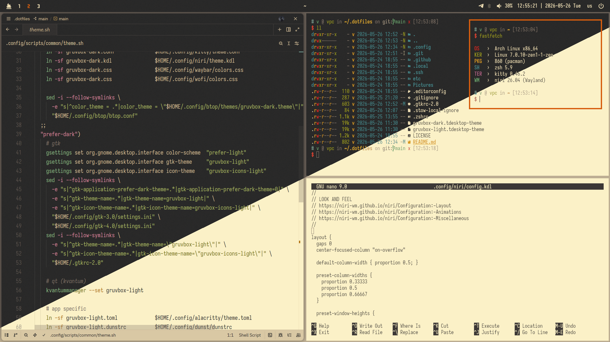
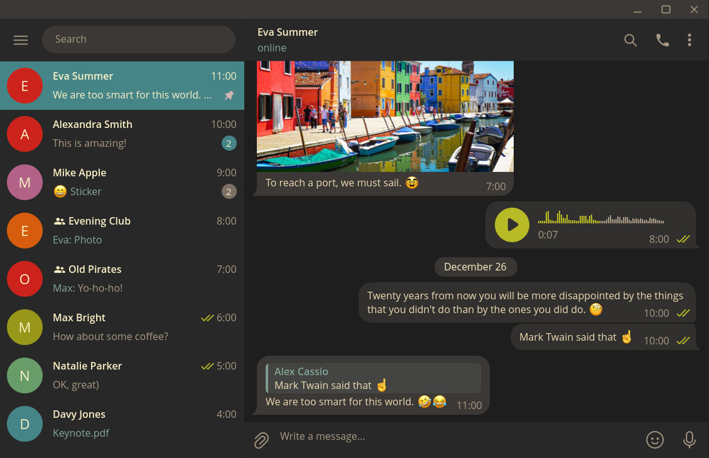

## dotfiles

####
<p align=center"></p>

####
<p align=center"></p>

#### init
```sh
git clone https://github.com/vargalott/dotfiles.git ~/.dotfiles
cd ~/.dotfiles
stow -v .
```

#### software list
```sh
niri
hyprland

zsh
oh-my-posh
kitty
alacritty

waybar
awww
hyprlock

wofi
fuzzel
dunst

fastfetch
fzf
```

#### credits
||||
|-|-|-|
| GTK-2/3/4 | [Gruvbox-GTK-Theme](https://github.com/Fausto-Korpsvart/Gruvbox-GTK-Theme) | Gruvbox-BL-LB-Dark-Medium |
| QT (Kvantum) | [gruvbox-kvantum-themes](https://github.com/sachnr/gruvbox-kvantum-themes) | Dark |
| Cursor | [Bibata_Cursor](https://github.com/ful1e5/Bibata_Cursor) | Modern-Ice |
| Icons | [gruvbox-plus-icon-pack](https://github.com/SylEleuth/gruvbox-plus-icon-pack) | Dark |
